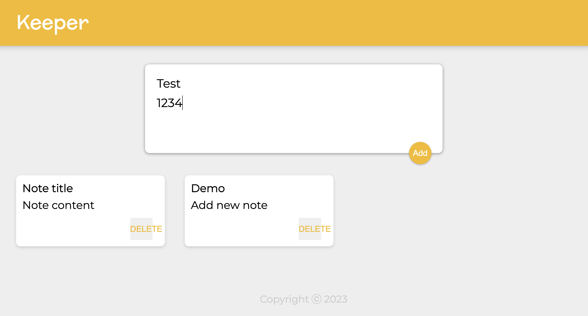

# Google Keep Clone

This is a clone of Google Keep, a note-taking application, built using ReactJS.

## Features

- Create and manage notes with a title and content
- Archive notes to keep your workspace organized
- Edit and delete existing notes
- Responsive design for seamless usage across devices

## Screenshots



## Installation

Install dependencies:

```bash
cd google-keep-clone
npm install
```

## Usage

Start the development server

```bash
 npm start
```

Open your browser and visit

```bash
   http://localhost:3000
```
